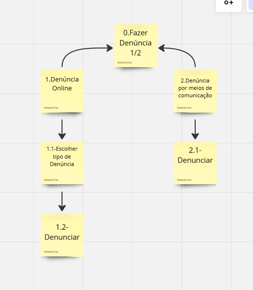

# Análise Hierárquica de Tarefas

## Introdução 
A Análise de Tarefas Hierárquica (HTA) é uma técnica de análise usada principalmente no design de interfaces de usuário e sistemas interativos. Ela se concentra em entender como os usuários realizam tarefas complexas, dividindo-as em etapas menores e mais gerenciáveis. Na HTA, a tarefa é decomposta em subtarefas menores, formando uma hierarquia que representa a estrutura da atividade. Cada subtarefa é detalhada até um nível em que possa ser facilmente compreendida e executada. Além disso, a análise pode incluir informações sobre os objetivos da tarefa, as condições em que é realizada, os recursos necessários e as possíveis interações com o ambiente e outros sistemas.

## Elementos de uma análise HTA

1. __Tarefas__: São as atividades que os usuários realizam para alcançar um objetivo específico dentro de um sistema interativo.

2. __Subtarefas__: São as etapas menores que compõem uma tarefa maior. As subtarefas são organizadas hierarquicamente para representar a estrutura da atividade.

3. __Objetivos__: Representam os resultados que os usuários desejam alcançar ao realizar uma tarefa. Os objetivos são fundamentais para orientar a análise e garantir que as subtarefas estejam alinhadas com as necessidades dos usuários.

4. __Planos__: São as sequências de subtarefas e ações necessárias para atingir um objetivo específico. Os planos descrevem o fluxo de trabalho ou a sequência de atividades que os usuários devem seguir para realizar uma tarefa com sucesso.

Como definido na figura 1.
### Tabela

 Figura 1 - Tabela Elementos de um diagrama HTA. 
 

Fonte :  BARBOSA, S.D.J.; SILVA, B.S. Interação Humano-Computador. Editora Campus-Elsevier, 2010.

## Funcionalidades Avaliadas pela HTA

    Tabela que monstra quais funcionalidades foram avaliadas pela HTA
 Funcionalidade    |    Integrante Responsável             |  
|:------:|:-------------------------------:|
|Pesquisar Procurados|Lara|  
| Solicitar Antecedentes Criminais | Renata |
| Validar Antecedentes Criminais | Joao |
| 197- Denúncia Online   | Giovana          |
| Solicitar Carteira de Identidade| Raissa
| Registrar Ocorrência | Rayene |

### Pesquisar Procurados
A Análise de Tarefas Hierárquica (HTA) é uma técnica de análise usada principalmente no design de interfaces de usuário e sistemas interativos. Ela se concentra em entender como os usuários realizam tarefas complexas, dividindo-as em etapas menores e mais gerenciáveis. 

Assim, na funcionalidade de _Procurados_ da Polícia Civil do DF, os elementos de uma análise HTA seriam:

- Tarefa: Inserir nome completo de uma pessoa civil com passagem pela polícia
- Objetivo: Pesquisar procurados pela PCDF
- Plano (subbjetivo): Clicar no _input box_ da página, inserir caracteres e enviar o formulário para realizar a busca

### Solicitar Antecedentes Criminais
Nessa tarefa o usuário pretende solicitar os antecedentes criminais no site da PCDF, foi analisada pela integrante  [Renata Quadros](https://github.com/Renatinha28) e feito o diagrama como monstrado na figura 2.

 Figura 2- Diagrama de Analise de Solicitar Antecedentes Criminais. 
 

Fonte: [Renata Quadros](https://github.com/Renatinha28) 

    Tabela que descreve Diagrama de Analise de Solicitar Antecedentes Criminais

|         Objetivos/operações         | Problemas e recomendações                                                                                                                                                                                      |
|:-----------------------------------:|----------------------------------------------------------------------------------------------------------------------------------------------------------------------------------------------------------------|
| 0. Solicitar antecedentes criminais 1>2  | **input**: formulário de solicitação de antecedentes criminais com os dados pessoais.  **Feedback**: antecedentes criminais.  **Plano**: informar email, confirmar e depois preencher os dados e depois confirmar.  **Recomendação**: permitir que o usuário preencha o formulário online. |
| 1. Informar email 1>2                    | **Plano**: informar email pessoal                                                                                                                                                                               |
| 1.1. Informar código de autorização 1>2  | **Plano**: informar código enviado no email inserido                                                                                                                                                             |
| 2. Solicitação                           |                                                                                                                                                                                                                |
| 2.1. Informar dados pessoais 1+2         | **Plano**: informar nome, nome da mãe, nome do pai, email, CPF, estado civil, RG, data de expedição, órgão expedidor, UF, data de nascimento, UF, naturalidade, sexo, CNH, passaporte                                                                                           |
| 2.1.1. Informar detalhes pessoais        |                                                                                                                                                                                                                |
| 2.2. Informar endereço residencial 1+2   | **Plano**: Informar CEP, endereço, complemento, UF, cidade, telefone celular, telefone fixo                                                                                                                                                        |
| 2.2.1. Informar detalhes residenciais    |                                                                                                                                                                                                                |
| 2.3. Informar endereço comercial 1+2     | **Plano**: Informar órgão/empresa, profissão, cargo, telefone comercial, CEP, endereço, complemento, UF, cidade                                                                                                 |
| 2.3.1. Informar detalhes comerciais      |                                                                                                                                                                                                                |
| 2.4. Informar finalidade da solicitação  | **Plano**: informar a finalidade da solicitação de antecedentes criminais                                                                                                                                       |
| 3. Enviar respostas                      |                                                                                                                                                                                                                |
| 4. Recibo                                | **Ação**: conferir solicitação  **Recomendação**: após 3 dias úteis conferir solicitação            |                                                                

### Validar Antecedentes Criminais

    Tabela HTA da validação de antecedentes criminais 

|         Objetivos/operações         | Problemas e recomendações|
|:-----------------------------------:|----------------------------------------------------------------------------------------------------------------------------------------------------------------------------------------------------------------|
| 0. Validar antecedentes criminais 1>2  | **input**: formulário de validação de antecedentes criminais com os dados da certidão.  **Feedback**: Muda para uma página com os dados da certidão, indicando se tal certidão é válida ou não  **Plano**: informar dados da certidão e responder o captcha, depois clicar em "Pesquisar".  |
| 1. Informar dados da certidão 1+2  | **Plano**: informar número da certidão, ano da certidão e data de nascimento na certidão |
| 1.1 Informar número da certidão, informar ano da certidão, informar data de nascimento na certidão|
| 1.2 Validar o CAPTCHA 1>2    | **Plano**: Responder o CAPTCHA, realizando a tarefa aleatória que ele exigir, se exigir |
| 1.2.1  Resolver o desafio do CAPTCHA |
| 2.  Enviar dados 1>2 | **Plano**: Clicar no botão "Pesquisar"|
| 2.1 Clicar no botão "Pesquisar" |

### 197- Denúncia Online

Nessa tarefa o usuário pretende fazer uma denúncia no site da PCDF, foi analisada pela integrante  [Giovana Barbosa](https://github.com/gio221), como monstrado na figura 3.

 Figura 2- Diagrama de Analise da Denúncia Online. 
 

Fonte :[Giovana Barbosa](https://github.com/gio221)  

    Tabela que descreve Diagrama de Analise da Denúncia Online

|     Objetivos/Operações      | Problemas e recomendações                                                                                                                                                                               |
| :--------------------------: | ------------------------------------------------------------------------------------------------------------------------------------------------------------------------------------------------------- |
|  0.Fazer Denúncia  |                                                                                                                                                                                                         |
|      1.Denúncia Online     | **input**: Ver qual denúncia vai fazer. **feedback**: usuário redirecionado para a página de denúncias  **plano**: procurar qual denúncia                                        |
|     1.1.Escolher tipo de denúncia      | **input**: Ver qual denúncia vai fazer. **feedback**: após ver qual denúncia quer fazer, clicar nela  **plano**: selecionar qual denúncia vai fazer                                             |
|       1.2.Fazer denuncia      | **input**: dados da denuncia. **feedback**: usuário deve preencher informações sobre a denúncia.   |
| 2.Denuncia por meios de comunicação | **input**: escolher qual meio de comunicação vai ultilizar e clicar nele. **feedback**: usuário redirecionado para o link do canal de comunicação(ligação, whatssap,e-mail) .                                                                                    | 
|       2.1.Fazer denuncia      | **input**: dados da denuncia. **feedback**: usuário deve preencher informações sobre a denúncia.   |
                                                                                  |

### Solicitar Carteira de Identidade 

|         Objetivos/operações         | Problemas e recomendações                                                                                                                                                                                      |
|:-----------------------------------:|----------------------------------------------------------------------------------------------------------------------------------------------------------------------------------------------------------------|
| 1.  Acessar o Site da PCDF | **input**: Digitar o endereço correto do site da PCDF no navegador ou clicar em um link fornecido.   **Feedback**: Página inicial do site da PCDF é exibida.  **Plano de Ação**: Abrir o navegador e digitar o endereço do site ou clicar em um link pré-fornecido.   |
| 2.         Localizar o Serviço de Emissão de Carteira de Identidade.          | **Input**: Navegar pela aba de "Serviços" para encontrar a solicitação do serviço.   **Feedback**: O serviço é encontrado e acessado.   **Plano de Ação**: Navegar pelos aba para encontrar o serviço específico de emissão de carteira de identidade.|
| 3.  Informar-se sobre os Requisitos e Procedimentos |**Input**: Ler as informações fornecidas sobre os requisitos, documentos necessários e procedimentos para solicitar a carteira de identidade.   **Feedback**: Entendimento claro dos requisitos e procedimentos.  **Plano de Ação**: Ler atentamente as informações fornecidas no site sobre os documentos necessários e os passos a serem seguidos para solicitar a carteira de identidade.                                                                       |
| 4. Preencher o Formulário de Solicitação Online   | **Input**: Preencher o formulário online com as informações pessoais necessárias.   **Feedback**: Confirmação de envio bem-sucedido do formulário.    **Plano de Ação**: Preencher corretamente o formulário online com os dados solicitados, incluindo informações pessoais e dados de contato.  |
| 5.Comparecer ao Posto de Atendimento | **Input**: Comparecer pessoalmente ao posto de atendimento na data e horário agendados, levando os documentos necessários.   **Feedback**: Verificação dos documentos e procedimentos para coleta de dados biométricos e fotográficos, se aplicável.   **Plano de Ação**: Comparecer ao posto de atendimento na data e horário agendados, levando todos os documentos solicitados. |
| 6. Acompanhar o Status da Solicitação   |  **Input**: Verificar o status da solicitação online.   **Feedback**: Atualizações sobre o andamento da solicitação.   **Plano de Ação**: Verificar regularmente o status da solicitação no site da PCDF.|                                                                                

### Registrar Ocorrência

|        Objetivos/operações                     | Problemas e Recomendações                                                                                                                                                                                                                                    |
|:----------------------------------------------:|--------------------------------------------------------------------------------------------------------------------------------------------------------------------------------------------------------------------------------------------------------------|
| 0. Acessar a seção "Registro de Ocorrência"   | **Input:** Navegar até a seção "Delegacia Eletrônica" através do menu de serviços.  **Feedback:** Localizar o botão "Registrar Ocorrência" após rolar a página.  **Plano:** Navegar pelo menu de serviços até encontrar a seção relevante.  **Recomendação:** Melhorar a visibilidade do botão "Registrar Ocorrência". |
| 1. Escolher a natureza da ocorrência          | **Input:** Selecionar uma das opções de natureza de ocorrência listadas.  **Feedback:** Navegar para o formulário de registro correspondente à natureza selecionada.  **Plano:** Escolher a natureza da ocorrência com base na situação.                                                                             |
| 1.1. Informar dados pessoais                  | **Input:** Fornecer informações pessoais no formulário de registro.  **Feedback:** Conclusão bem-sucedida do formulário de registro.  **Plano:** Preencher todas as seções do formulário com informações precisas.                                                                                             |
| 1.2. Informar detalhes da ocorrência          | **Input:** Fornecer detalhes específicos sobre a ocorrência no formulário.  **Feedback:** Conclusão bem-sucedida dos detalhes da ocorrência.  **Plano:** Preencher todas as seções relevantes do formulário com informações precisas.                                                                 |
| 2. Revisar e enviar o formulário              | **Input:** Revisar as informações inseridas e enviar o formulário.  **Feedback:** Submissão bem-sucedida da ocorrência.  **Plano:** Revisar todas as informações fornecidas antes de enviar.  **Recomendação:** Incluir uma etapa de confirmação antes do envio final.                                               |
| 2.1. Receber confirmação da ocorrência        | **Input:** Receber confirmação da submissão da ocorrência.  **Feedback:** Receber uma confirmação por email ou na própria página.  **Plano:** Aguardar pela confirmação após o envio do formulário.                 

### Retrato Falado Online: Descreva e Identifique 
Nessa tarefa o usuário pretende fazer um retrato falado de forma online no site da PCDF, foi analisada pela integrante  [Renata Quadros](https://github.com/Renatinha28) e feito o diagrama como monstrado na figura 4.

 Figura 2- Diagrama de Analise de Solicitar Antecedentes Criminais. 
 

Fonte: [Renata Quadros](https://github.com/Renatinha28) 

    Tabela que descreve Diagrama de Analise do Retrato Falado Online

|         Objetivos/operações         | Problemas e recomendações                                                                                                                                                                                      |
|:-----------------------------------:|----------------------------------------------------------------------------------------------------------------------------------------------------------------------------------------------------------------|
| 0. Acessar "Denúncia Online" 1>2 | |
| 1. Selecionar "Retrato Falado Online" |  **Plano:** Identificar e selecionar a opção de "Retrato Falado Online" dentro da seção de "Denúncia Online". |
| 2. Preencher o formulário de Retrato Falado Online 1+2 | **input**: formulário de retrato falado online.   |
| 2.1. Informar dados pessoais 1+2 | **Plano**: informar nome, email, CPF |                                                               
| 2.2. Selecionar o tipo de denúncia 1+2 | **Plano**: informar o tipo de denúncia |
| 2.3. Descrever o incidente e o suspeito 1+2 | **Plano**: Descrever detalhadamente o incidente e as características do suspeito com base nas observações do denunciante. |
| 2.4. Criar o retrato falado do suspeito 1+2 | **input**: apertar o botão de criar avatar.  **Recomendação**: Fornecer uma interface de criação intuitiva e fácil de usar.|
| 2.4.1. Selecionar um avatar gerado 1>2 | **Plano**: selecionar um avatar dentre as 6 opções dadas pela IA |
| 2.4.2. Avaliar avatar selecionado 1+2 | **Plano**: avaliar o avatar selecionado descrever a fidelidade da imagem de acordo com a lembrança do suspeito |
| 3. Enviar a denúncia | |
| 4. Receber confirmação da denúncia | **Ação**: conferir solicitação e informações necessárias   **Recomendação**: Enviar uma confirmação clara da recepção da denúncia e informar sobre os próximos passos no processo de investigação, incluindo prazos para atualizações.  |

## Bibliografia
> BARBOSA, S.D.J.; SILVA, B.S. Interação Humano-Computador. Editora Campus-Elsevier, 2010.

## Histórico de Versões

    Tabela que descreve o Histórico de Versões
| Versão |          Descrição              |     Autor(es)      |      Data      |   Revisor(es)     |    Data de revisão    |  
|:------:|:-------------------------------:|:--------------:|:--------------:|:-------------:|:---------------------:|
|  1.0   | Criação do documento de hta                  |  [Giovana Barbosa](https://github.com/gio221)      |   18/04   |     [Raissa Andrade](https://github.com/RaissaAndradeS)   |        18/04     |
|  1.1   | Registro de Ocorrência                    |   [Rayene Almeida](https://github.com/rayenealmeida)      |   18/04   |       [Raissa Andrade](https://github.com/RaissaAndradeS)        |          18/04          |
|  1.2   | 197               |   [Giovana Barbosa](https://github.com/gio221)        |   18/04   |    [Renata Quadros](https://github.com/Renatinha28)   | 19/04               |
| 1.3 | Solicitar antecedentes criminais | [Renata Quadros](https://github.com/Renatinha28) | 19/04 | [Rayene Almeida](https://github.com/rayenealmeida) | 19/04 |
|1.4| Solicitação de Carteira de Identidade|[Raissa Andrade](https://github.com/RaissaAndradeS)|19/04| [Renata Quadros](https://github.com/Renatinha28) | 19/04 |
|1.5| Atualização do Índice|[Rayene Almeida](https://github.com/rayenealmeida)|09/05|  [Renata Quadros](https://github.com/Renatinha28) | 09/05  |
| 1.6 | Retrato falado online | [Renata Quadros](https://github.com/Renatinha28) | 09/05 | | |