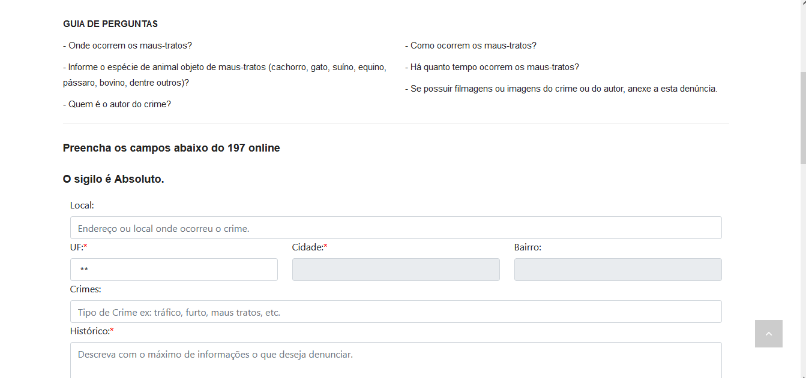

# Introdução 
Os cenários são uma narrativa, textual ou pictórica, concreta, rica em detalhes contextuais, de uma situação de uso da aplicação, envolvendo usuários, processos e dados reais ou potenciais (Rosson e Carrol, 2002).

## Metodologia
A metodologia ultilizada é que cada funcionalidade vai ser colocada em um cenário com base no Capítulo 6 do livro de Barbosa e Silva.

## Elementos Característicos de um Cenário
* __Ambiente ou Contexto__: Detalhes da situação que motivam ou explicam os objetivos, ações e reações dos atores do cenário;
* __Atores__: Pessoas interagindo com o computador ou outros elementos do ambiente; características pessoais relevantes ao cenário;
* __Objetivos__: Efeitos na situação que motivam as ações realizadas pelos atores;
* __Planejamento__: atividade mental dirigida para transformar um objetivo em um comportamento ou conjunto de ações;
* __Ações__: Comportamento observável;
* __Eventos__: Ações externas ou reações produzidas pelo computador ou outras características do ambiente;
* __Avaliação__: Atividade mental dirigida para interpretar a situação.

# Pesquisar procurados 

# Solicitar antecedentes Criminais 

# Validar certidão de antecedentes criminais 

# 197- Denúncia Online

Esse cenário foi criado por [Giovana Barbosa ](https://github.com/gio221) é baseado em uma persona que definimos como usuária do site PCDF, que deseja bloquear um celular roubado

    

Figura 1: Persona Ana

Fonte: gerado através do site this-person-does-not-exist.com

Ana monstrada na figura 1, é dona de casa, ela mora em Ceilândia com três filhos e seu marido, a dois meses atrás ela percebeu uma movimentação no lote ao lado, alguns vizinhos novos estavam se mudando para lá. Ana foi simpática com eles e os conheceu, eram um casal com dois cachorros maiores.
Depois de mais ou menos um mês e meio que os novos vizinhos mudaram ela começou a escutar barulhos estranhos de cachorros chorando, no começo ela achou que eles estavam brincando ou algo similar.
Mas os dias foram passando e esses barulhos foram se tornando constantes, depois de um tempo Ana começou a se preocupar e prestar mais atenção nos vizinhos novos. A casa de Ana era um sobrado então ela conseguia ver o quintal dos vizinhos.
Um dia Ana estava cuidando da casa e quando olhou para o lote vizinho ela viu os dois cachorros dos vizinhos bem desidratados, amarrados e com focinheira, Ana ficou bastante assustada, e como ela já tinha usado o site da PCDF para solicitar sua carteira de identidade, ela abriu o site, e viu que tinha como fazer denúncia online por lá, e quando ela entrou ela achou a aba para Denúncia de Maus Tratos Animais, como montrado na figura 2.

    

Figura 2 : Informações sobre a Denúncia do 197 Online

Fonte: site PCDF

Então Ana fez a denúncia anônima,com os passos monstrado na figura 3, e depois de mais ou menos um dia, a policia foi até os vizinhos e regataram os animais e levaram para abrigos.

    

Figura 3 : Informações sobre a Denúncia de Maus Tratos Animais

Fonte: site PCDF

# Solicitar carteira de identidade 

O cenário criado por [Raissa Andrade](https://github.com/RaissaAndradeS) é baseado em uma pessoa fictícia tentando marcar para revonar sua carteira de identidade.  

 Figura 4 : Adriano
 

 Fonte:gerado através do site this-person-does-not-exist.com

Adriano Valverde como monstrado na figura 4, tem 17 anos, terminou o ensino médio, encontra - se estudando para concurso. Adriano é menor de idade, ainda não tem a CNH. Ele tirou o Registro Geral (RG) ainda quando era criança e não sabia que seu RG tem validade, de 0 a 12 anos, tem a validade de 5 anos. De 12 a 60 anos incompletos, tem validade de 10 anos e acima de 60 anos tem validade indeterminada. 
Adriano irá prestar concurso, precisa manter a carteira de identidade atualizada e para conseguir emitir um novo RG, adriano precisa acessar o site da Polícia Civil do Distrito Federal, na aba de "Serviços" acessará carteira de identidade que vai leva - lo para outra página e nessa página, ele conseguira agendar um horário para emitir seu novo documento.  Mas adriano não consegue concluir seu agendamento pelo site da PCDF, ao tentar marcar agendamento, mesmo mostrando um horário disponível, ao final ha uma mensagem mostrando ao contrario. Mas Adriano precisa muito desse documento, então ele deu refresh na pagina e quando foi escolher a opção de lugar, já não havia mais o gama e ele conseguiu mas apenas na unidade de samambaia, como montrado na figura 5.

 Figura 5: Print do agendamneto

Fonte: site da PCDF
 

# Registra Ocorrência 

## Histórico de versão
|     Versão       |     Descrição      |      Autor(es)      | Data           |  Revisor(es)          |Data de revisão|
| :----------------------------------------------------------: | :-------------------------------: | :-------------------------------------------------: | :-------------------------------: |  :-------------------------------: | :-------------------------------: |
| 1.0 |  Criação de Cenário  | [Giovana Barbosa ](https://github.com/gio221) | 18/04 | [Raissa Andrade](https://github.com/RaissaAndradeS)| 18/08 |
| 1.1 | Cenário da carteira inserido | [Raissa Andrade](https://github.com/RaissaAndradeS) | 18/04 |[Giovana Barbosa ](https://github.com/gio221) | 18/04|
| 1.2 | Cenário do bloqueio de celular| [Giovana Barbosa ](https://github.com/gio221) | 18/04 | | |
