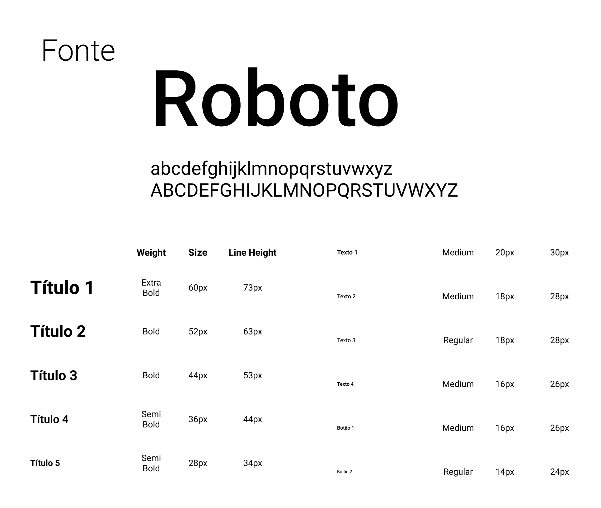
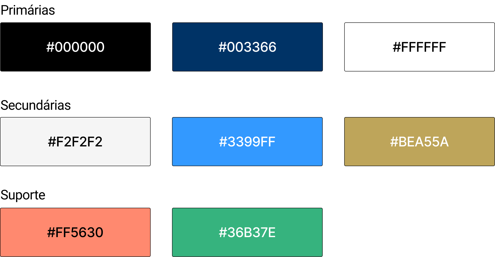
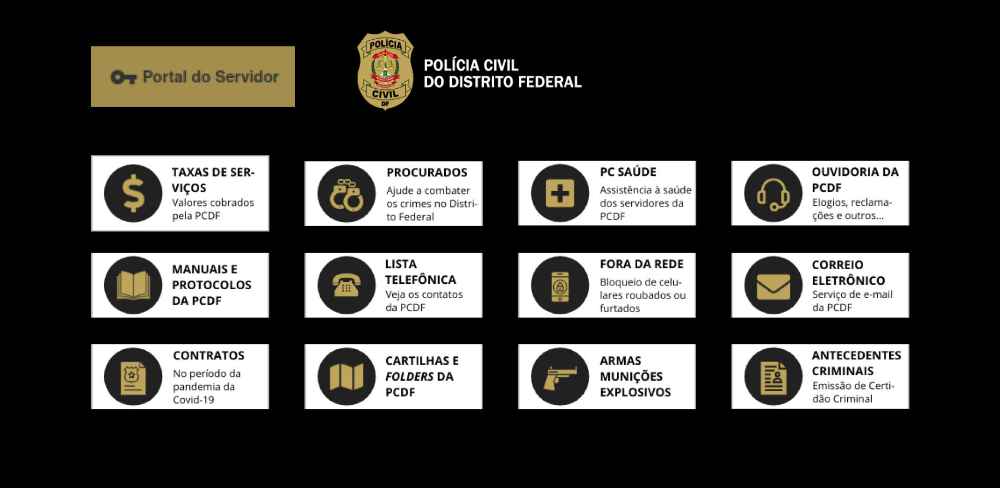
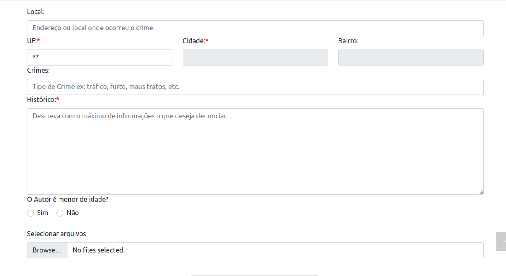
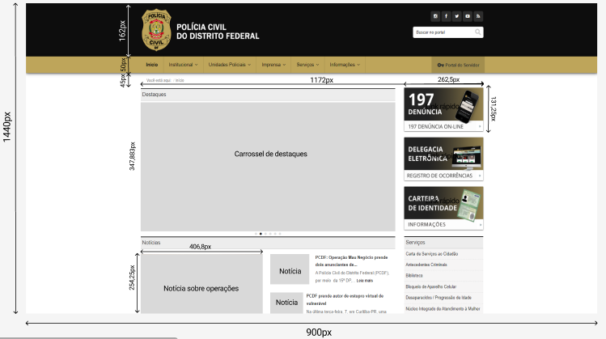
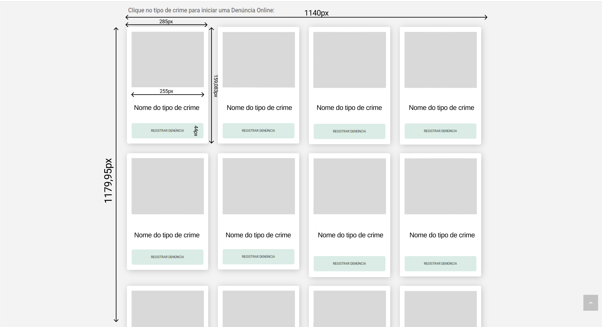
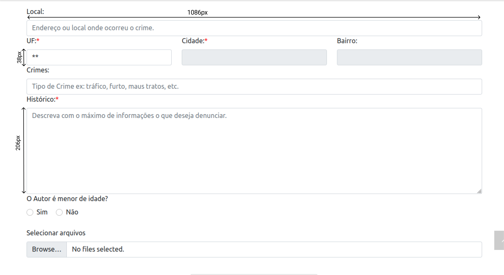

## Introdução 
De acordo com o livro "Interação Humano-Computador" de Barbosa e Silva(2010), um guia de estilo é um documento que estabelece diretrizes para a criação de interfaces gráficas de usuário consistentes e eficientes. Essas diretrizes geralmente incluem recomendações de design, como layout, tipografia, cores, iconografia, além de orientações sobre interação e usabilidade. 

## Objetivo do Guia de Estilo
O objetivo principal de um guia de estilo é promover a coerência e a usabilidade em produtos de software, garantindo uma experiência de usuário mais satisfatória e eficiente. Neste sentido, para melhores práticas será analisado os seguintes elementos:

- **Elementos de interface**: Design de telas, visualização de informações, disposição espacial e grid, elementos de interface, janelas, tipografia, símbolos, logo e cores;

- **Elementos de interação**: Estilos de interação, seleção de um estilo e aceleradores;

- **Elementos de ação**: Preenchimento de campos, seleção e ativação.

### Organização e Conteúdo do Guia de Estilo
O Guia de Estilo para o site da PCDF será feito de forma abrangente que estabelece diretrizes claras e consistentes para o design e interação do usuário. Portanto, será utilizado os elementos citados anteriormente.

### Público-alvo do Guia de Estilo
O Guia de Estilo da PCDF destina-se aos alunos da disciplina Interação Humano-Computador além de profissionais da PCDF envolvidos no design, desenvolvimento e manutenção do site, incluindo designers de interface e desenvolvedores front-end.

### Como utilizar o Guia
Este guia de estilo da PCDF serve como um recurso fundamental para orientar as decisões de design ao longo do projeto da disciplina de Interação Humano-Computador, cobrindo tanto as fases de produção quanto de manutenção. As diretrizes e práticas recomendadas aqui são essenciais para as escolhas de design, garantindo que a interface do usuário atenda aos objetivos do projeto. 

### Como manter o Guia
A manutenção contínua do Guia de Estilo é vital para sua relevância ao longo do tempo. Isso inclui revisões regulares para atualização conforme as melhores práticas de design, feedback dos usuários para identificar áreas de melhoria, comunicação transparente sobre atualizações e estabelecimento de um sistema de versionamento claro. 

## Resultado da Análise 
Os usuários acessam o site PCDF por diferentes dispositivos, computadores sendo eles desktops ou notebooks e dispositivos móveis. Neste contexto, é importante projetar e desenvolver a interface do site levando em consideração a responsividade.

## Elementos de Interface
Um guia de estilo de interfaceé um conjunto de padrões e diretrizes que garantem a consistência visual e funcional de uma aplicação ou website.

### Tipografia

Figura 1: Tipografia

Fonte: Rayene Almeida (criado pelo Figma)

- Fontes: É usado fontes como Roboto para garantir legibilidade e profissionalismo.
- Tamanho Títulos (24px), subtítulos (20px), texto do corpo (16px), notas de rodapé (14px). 
- Peso: Os títulos em negrito, subtítulos em semi-negrito e texto do corpo em regular.
- Espaçamento: Linha de 1.5 para texto do corpo, 1.2 para títulos.

### Cores

Figura 2: Cores

Fonte: Rayene Almeida (criado pelo Figma)

- Primárias: Preto (#000000) para cabeçalhos e rodapés, azul escuro (#003366), branco (#FFFFFF) para fundos.
- Secundárias: Cinza claro (#F2F2F2) para seções de fundo, azul claro (#3399FF) para botões de chamada para ação e amarelo escuro (#BEA55A) para menu e botão.
- Suporte: Vermelho (#FF0000) para alertas e avisos, verde (#33CC33) para confirmações e sucessos.

### Botões e Ícones

Figura 3: Botões

Fonte: Rayene Almeida (criado pelo Figma)

Estilo: Bordas arredondadas com 4px de raio, sombra sutil para elevação.

**Ícones:**Ícones lineares simples, utilizando a biblioteca FontAwesome ou similar. Tamanho 24px para ícones em botões, 20px para ícones em listas ou navegação.

### Formulários

Figura 4: Formulários

Fonte: site PCDF

- Campos de Entrada: Bordas cinza claro (#CCCCCC), foco com borda azul (#3399FF).
- Botões de Rádio e Caixas de Seleção: Azul escuro para itens selecionados, cinza para não selecionados.
- Drop-downs: Fundo branco, borda cinza claro, setas em azul escuro.

### Layouts e Grid

- Estrutura: Grid de 12 colunas com espaçamento de 24px entre colunas.
- Margens e Padding: Margens de 16px em dispositivos móveis, 24px em tablets, 32px em desktops.
- Responsividade: Adaptável a diferentes tamanhos de tela com pontos de quebra específicos.

Figura 5: Grid página inicial

Fonte: Figma e site PCDF

Figura 6: Grid página de seleção

Fonte: Figma e site PCDF

Figura 7: Grid página de formulário

Fonte: Figma e site PCDF

## Elementos de Interação

## Elementos de Ação

## Vocabulário e padrões
- **Terminologia Familiar:** Durante o processo de desenvolvimento do protótipo, foi crucial empregar uma linguagem acessível e familiar aos usuários. Evitando o uso excessivo de termos técnicos, algo imnportante para garantir que todos os usuários, incluindo os iniciantes, possam compreender e utilizar a aplicação de forma intuitiva. Dessa forma, promovemos uma experiência de usuário mais inclusiva e eficaz, contribuindo para o sucesso do projeto de design.

- **Tipos de tela (para tarefas comuns):** Para garantir consistência e familiaridade na experiência do usuário, é importante que os diferentes tipos de tela para tarefas comuns sigam os padrões definidos nos Elementos de interface de disposição espacial e grid. Esses padrões proporcionam uma estrutura visual coesa e previsível em todo o sistema, facilitando a navegação e a interação dos usuários.

- **Sequências de diálogos:** Para garantir uma interação consistente e intuitiva, é fundamental padronizar as sequências de diálogos em todo o sistema. Isso envolve seguir o padrão especificado nos elementos de interação, garantindo que os botões estejam posicionados de maneira semelhante em todas as sequências de diálogos. 

## Referência Bibliográfica
> BARBOSA, S.D.J.; SILVA, B.S. Interação Humano-Computador. Editora Campus-Elsevier, 2010.
> MARCUS, A. Graphic design for electronic documents and user interfaces. Association for Computing Machinery, New York, NY, USA, 1991.

## **Histórico de Versões**

|     Versão       |     Descrição      |      Autor(es)      | Data           |  Revisor(es)          |Data de revisão|
| :----------------------------------------------------------: | :-------------------------------: | :-------------------------------------------------: | :-------------------------------: |  :-------------------------------: | :-------------------------------: |
| 1.0 | Criação do Guia de Estilo | [Rayene Almeida](https://github.com/rayenealmeida) | 10/05 | [Giovana Barbosa](https://github.com/gio221)   |11/05 |
| 1.1 | Correção do Guia de Estilo | [Rayene Almeida](https://github.com/rayenealmeida) | 17/05 |   |  |