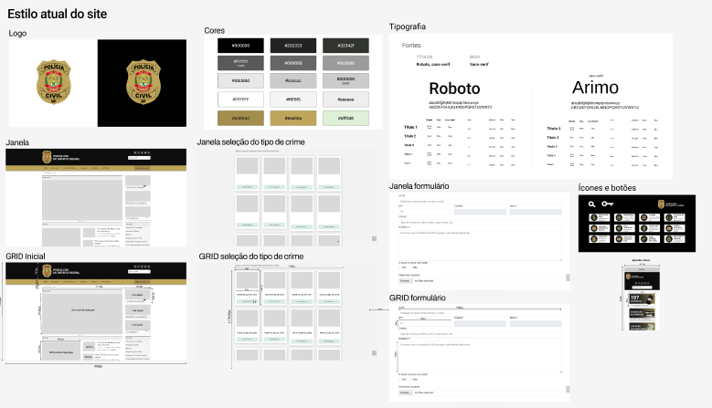

## Introdução 
De acordo com o livro "Interação Humano-Computador" de Barbosa e Silva(2010), um guia de estilo é um documento que estabelece diretrizes para a criação de interfaces gráficas de usuário consistentes e eficientes. Essas diretrizes geralmente incluem recomendações de design, como layout, tipografia, cores, iconografia, além de orientações sobre interação e usabilidade. 

## Objetivo do Guia de Estilo
O objetivo principal de um guia de estilo é promover a coerência e a usabilidade em produtos de software, garantindo uma experiência de usuário mais satisfatória e eficiente. Neste sentido, para melhores práticas será analisado os seguintes elementos:

- **Elementos de interface**: Design de telas, visualização de informações, disposição espacial e grid, elementos de interface, janelas, tipografia, símbolos, logo e cores;

- **Elementos de interação**: Estilos de interação, seleção de um estilo e aceleradores;

- **Elementos de ação**: Preenchimento de campos, seleção e ativação.

### Organização e Conteúdo do Guia de Estilo
O Guia de Estilo para o site da PCDF será feito de forma abrangente que estabelece diretrizes claras e consistentes para o design e interação do usuário. Portanto, será utilizado os elementos citados anteriormente.

### Público-alvo do Guia de Estilo
O Guia de Estilo da PCDF destina-se aos alunos da disciplina Interação Humano-Computador além de profissionais da PCDF envolvidos no design, desenvolvimento e manutenção do site, incluindo designers de interface e desenvolvedores front-end.

### Como utilizar o Guia
Este guia de estilo da PCDF serve como um recurso fundamental para orientar as decisões de design ao longo do projeto da disciplina de Interação Humano-Computador, cobrindo tanto as fases de produção quanto de manutenção. As diretrizes e práticas recomendadas aqui são essenciais para as escolhas de design, garantindo que a interface do usuário atenda aos objetivos do projeto. 

### Como manter o Guia
A manutenção contínua do Guia de Estilo é vital para sua relevância ao longo do tempo. Isso inclui revisões regulares para atualização conforme as melhores práticas de design, feedback dos usuários para identificar áreas de melhoria, comunicação transparente sobre atualizações e estabelecimento de um sistema de versionamento claro. 

## Resultado da Análise 
Os usuários acessam o site PCDF por diferentes dispositivos, computadores sendo eles desktops ou notebooks e dispositivos móveis. Neste contexto, é importante projetar e desenvolver a interface do site levando em consideração a responsividade.

## Elementos de Interface, interação e ação
Aqui se apresenta os elementos sobre design de telas, visualização de informações, disposição espacial e grid, elementos de interface, janelas, tipografia, símbolos, logo e cores que foram elaborados pela ferramenta Figma. Respresentados na Figura 1 abaixo:

    

        
    

    
Figura 1: Guia de estilo

    
Fonte: Rayene Alemida (criado pelo Figma)

## Vocabulário e padrões
- **Terminologia Familiar:** Durante o processo de desenvolvimento do protótipo, foi crucial empregar uma linguagem acessível e familiar aos usuários. Evitando o uso excessivo de termos técnicos, algo imnportante para garantir que todos os usuários, incluindo os iniciantes, possam compreender e utilizar a aplicação de forma intuitiva. Dessa forma, promovemos uma experiência de usuário mais inclusiva e eficaz, contribuindo para o sucesso do projeto de design.

- **Tipos de tela (para tarefas comuns):** Para garantir consistência e familiaridade na experiência do usuário, é importante que os diferentes tipos de tela para tarefas comuns sigam os padrões definidos nos Elementos de interface de disposição espacial e grid. Esses padrões proporcionam uma estrutura visual coesa e previsível em todo o sistema, facilitando a navegação e a interação dos usuários.

- **Sequências de diálogos:** Para garantir uma interação consistente e intuitiva, é fundamental padronizar as sequências de diálogos em todo o sistema. Isso envolve seguir o padrão especificado nos elementos de interação, garantindo que os botões estejam posicionados de maneira semelhante em todas as sequências de diálogos. 

## Bibliografia
> BARBOSA, S.D.J.; SILVA, B.S. Interação Humano-Computador. Editora Campus-Elsevier, 2010.

## **Histórico de Versões**

|     Versão       |     Descrição      |      Autor(es)      | Data           |  Revisor(es)          |Data de revisão|
| :----------------------------------------------------------: | :-------------------------------: | :-------------------------------------------------: | :-------------------------------: |  :-------------------------------: | :-------------------------------: |
| 1.0 | Criação do Guia de Estilo | [Rayene Almeida](https://github.com/rayenealmeida) | 10/05 |  |  |