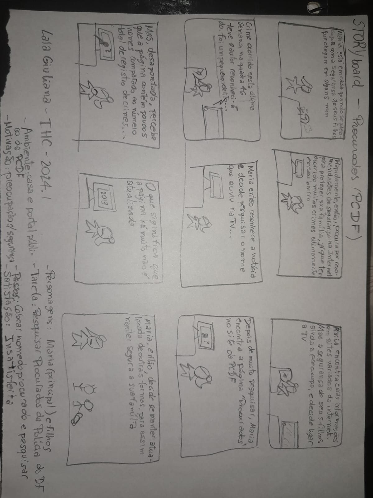
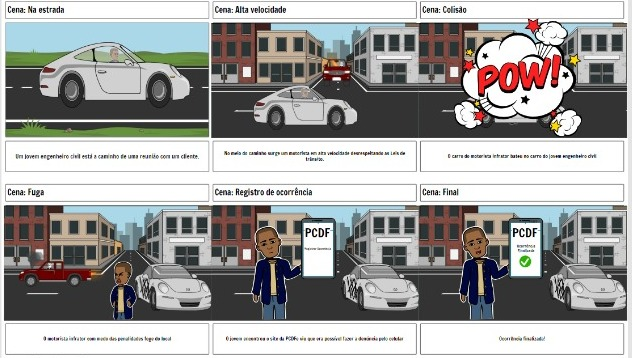

## Introdução
O relato desempenha um papel importante em interação humano computadorpois oferece insights sobre o processo do design, implementação e uso interativo das funcionalidades. Elepossui a função de fornecer a compreensão das entrevistas do storyboard.

## Foco do artefato
O foco do artefato é centrado em relatar os dados e resultados obtidos por meio das entrevistas realizadas com os usuários. Essas informações são essenciais para entender não apenas a eficácia do storyboard em comunicar a narrativa visual, mas também para identificar áreas de melhoruas que podem significar futuras interações com o projeto.

## Metodologia
A avaliação foi realizada por meio de entrevistas, utilizando storyboards e a análise GOMS para avaliar a funcionalidade. Isso permitiu identificar as necessidades dos usuários através de acompanhamento presencial. A coleta de dados incluiu observação direta, gravação das interações para análise posterior, aplicação de questionários e análise de feedback, proporcionando uma visão abrangente dos resultados.

## Participantes
Foi entrevistado 6 pessoas que aceitaram os termos de consentimento com 5 participantes entrevistadores no total com locais das entrevistas presenciais. Neste Documento apresentasse as entrevistas das funcionalidades de Pesquisar procurados, Retrato falado e Registro de Ocorrência.

## Storyboards utilizados
Aqui estão os storys boards referentes às gravações das entrevistas abaixo.
A figura 1 é o storyboard do Pesquisar procurados feito pela integrante [Lara Giuliana](https://github.com/gravelylara)

    
 Figura 1: Stroryboard de Pesquisar procurados  . Fonte: 
        <a href="https://github.com/gravelylara">Lara</a>
    
 

A figura 2 é o storyboard do Solicitar Carteira de Identidade o feito pela integrante [Raissa Andrade](https://github.com/RaissaAndradeS)

    
 Figura 2: Storyboard de Solicitar Carteira de Identidade  . Fonte: 
        <a href="https://github.com/RaissaAndradeS">Raissa</a>
    
 

A figura 3 é o storyboard do Registro de Ocorrência feito pela integrante [Rayene Almeida](https://github.com/rayenealmeida)

    
 Figura 3: Storyboard de Registro de Ocorrência . Fonte: 
        <a href="https://github.com/rayenealmeida">Rayene</a>
    
 

## Gravações
### Pesquisar procurados

  <iframe width="560" height="315" src="https://www.youtube.com/embed/KwaRsg9lFoI" frameborder="0" allowfullscreen></iframe>

**Perguntas e Respostas**

1. Qual seu nome completo? **Resposta:** Nícolas Yuri

2. Qual sua idade? **Resposta:** 20 anos

3. Qual sua ocupação? **Resposta:** Estudante

4. Os usuários representados no storyboard são semelhantes aos usuários reais do sistema? **Resposta:** Sim

5. O cenário descrito no storyboard parece realista e relevante para os usuários do sistema **Resposta:** Sim

6. Os estímulos apresentados no storyboard parecem adequados para incentivar os usuários a realizar ações? **Resposta:** Não

7. O storyboard parece ser apropriado para o público-alvo do produto? **Resposta:** Não sei responder

8. O storyboard demonstra claramente como o produto resolve os problemas ou necessidades dos usuários **Resposta:** Sim

9. Os usuários conseguiram alcançar seus objetivos ao interagir com o storyboard? **Resposta:** Sim

10. As informações fornecidas no storyboard são fáceis de entender para os usuários? **Resposta:** Sim

11. Os usuários enfrentaram alguma dificuldade durante a interação com o storyboard? **Resposta:** Não

12. O storyboard fornece todas as informações necessárias para os usuários completarem suas tarefas? **Resposta:** Sim

13. O storyboard destaca os principais benefícios e vantagens do produto para os usuários? **Resposta:** Sim

14. As ações realizadas no Storyboard seguem uma ordem sequencial, fluida e lógica? **Resposta:** Sim

15. Você tem alguma sugestão ou feedback para melhorar o storyboard? **Resposta:** Não

### Solicitar carteira de identidade

  <iframe width="560" height="315" src="https://www.youtube.com/embed/hKgmDzaR6K4" frameborder="0" allowfullscreen></iframe>

**Perguntas e Respostas**

1. Qual seu nome completo? **Resposta:** Hugo

2. Qual sua idade? **Resposta:** 

3. Qual sua ocupação? **Resposta:** 

4. Os usuários representados no storyboard são semelhantes aos usuários reais do sistema? **Resposta:** Não sei responder

5. O cenário descrito no storyboard parece realista e relevante para os usuários do sistema **Resposta:** Sim

6. Os estímulos apresentados no storyboard parecem adequados para incentivar os usuários a realizar ações? **Resposta:** Não

7. O storyboard parece ser apropriado para o público-alvo do produto? **Resposta:** Não sei responder

8. O storyboard demonstra claramente como o produto resolve os problemas ou necessidades dos usuários **Resposta:** Sim

9. Os usuários conseguiram alcançar seus objetivos ao interagir com o storyboard? **Resposta:** Sim

10. As informações fornecidas no storyboard são fáceis de entender para os usuários? **Resposta:** Sim

11. Os usuários enfrentaram alguma dificuldade durante a interação com o storyboard? **Resposta:** Não

12. O storyboard fornece todas as informações necessárias para os usuários completarem suas tarefas? **Resposta:** Não sei repsonder

13. O storyboard destaca os principais benefícios e vantagens do produto para os usuários? **Resposta:** Sim

14. As ações realizadas no Storyboard seguem uma ordem sequencial, fluida e lógica? **Resposta:** Sim

15. Você tem alguma sugestão ou feedback para melhorar o storyboard? **Resposta:** Não

### Registro de Ocorrência

  <iframe width="560" height="315" src="https://www.youtube.com/embed/p-WfgB0TgAE" frameborder="0" allowfullscreen></iframe>

**Perguntas e Respostas**

1. Qual seu nome completo? **Resposta:** Victor Moreira Almeida

2. Qual sua idade? **Resposta:** 20(vinte) anos de idade

3. Qual sua ocupação? **Resposta:** Estudante

4. Os usuários representados no storyboard são semelhantes aos usuários reais do sistema? **Resposta:** Sim 

5. O cenário descrito no storyboard parece realista e relevante para os usuários do sistema **Resposta:** Sim

6. Os estímulos apresentados no storyboard parecem adequados para incentivar os usuários a realizar ações? **Resposta:** Sim

7. O storyboard parece ser apropriado para o público-alvo do produto? **Resposta:** Sim

8. O storyboard demonstra claramente como o produto resolve os problemas ou necessidades dos usuários **Resposta:** Sim

9. Os usuários conseguiram alcançar seus objetivos ao interagir com o storyboard? **Resposta:** Sim

10. As informações fornecidas no storyboard são fáceis de entender para os usuários? **Resposta:** Sim

11. Os usuários enfrentaram alguma dificuldade durante a interação com o storyboard? **Resposta:** Não

12. O storyboard fornece todas as informações necessárias para os usuários completarem suas tarefas? **Resposta:** Sim

13. O storyboard destaca os principais benefícios e vantagens do produto para os usuários? **Resposta:** Sim

14. As ações realizadas no Storyboard seguem uma ordem sequencial, fluida e lógica? **Resposta:** resposta da pergunta: Sim

15. Você tem alguma sugestão ou feedback para melhorar o storyboard? **Resposta:** Sim, na finalização 

## Sugestões de Melhorias

### Pesquisar procurados
1. Melhorar de forma que fique mais objetivo

### Solicitar carteira de identidade
Não há sugestão de melhoria. 

### Registro de Ocorrência
1. Melhorar detalhando mais a finalização do registro de ocorrência mostrando melhor com é no site PCDF para ter uma visão mais próxima de como é finalizado uma ocorrência no site.

## Bibliografia
> BARBOSA, S.D.J.; SILVA, B.S. Interação Humano-Computador. Editora Campus-Elsevier, 2010.
> Planejamento do relato dos resultados da avaliação 

## **Histórico de Versões**

|     Versão       |     Descrição      |      Autor(es)      | Data           |  Revisor(es)          |Data de revisão|
| :----------------------------------------------------------: | :-------------------------------: | :-------------------------------------------------: | :-------------------------------: |  :-------------------------------: | :-------------------------------: |
| 1.0 | Relato | [Rayene Almeida](https://github.com/rayenealmeida) | 18/05 |   [Giovana](https://github.com/gio221)   | 01/06 | 

