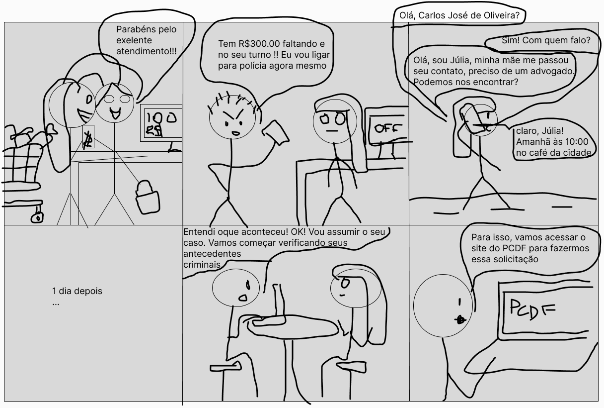
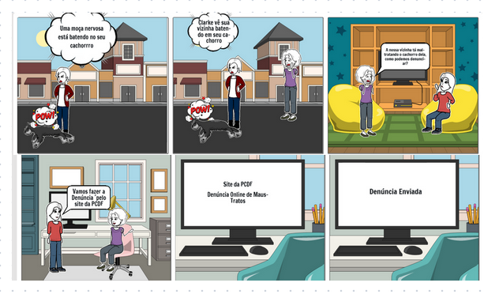

## Introdução
O relato desempenha um papel importante em interação humano computadorpois oferece insights sobre o processo do design, implementação e uso interativo das funcionalidades. Elepossui a função de fornecer a compreensão das entrevistas do storyboard.

## Foco do artefato
O foco do artefato é centrado em relatar os dados e resultados obtidos por meio das entrevistas realizadas com os usuários. Essas informações são essenciais para entender não apenas a eficácia do storyboard em comunicar a narrativa visual, mas também para identificar áreas de melhoruas que podem significar futuras interações com o projeto.

## Metodologia
A avaliação foi realizada por meio de entrevistas, utilizando storyboards e a análise GOMS para avaliar a funcionalidade. Isso permitiu identificar as necessidades dos usuários através de acompanhamento presencial. A coleta de dados incluiu observação direta, gravação das interações para análise posterior, aplicação de questionários e análise de feedback, proporcionando uma visão abrangente dos resultados.

## Participantes
Foi entrevistado 6 pessoas que aceitaram os termos de consentimento com 5 participantes entrevistadores no total com locais das entrevistas presenciais. Neste Documento apresentasse as entrevistas das funcionalidades de Pesquisar procurados, Retrato falado e Registro de Ocorrência.

## Storyboards utilizados
Aqui estão os storyboards referentes às gravações das entrevistas abaixo.
As figuras 1 e 2 são o storyboard de pesquisa de Procurados feito pela integrante [Lara Giuliana](https://github.com/gravelylara).

    
 Figura 1: Stroryboard de Pesquisar procurados. Fonte: 
        <a href="https://github.com/gravelylara">Lara</a>
    
 

    
 Figura 2: Stroryboard de Pesquisar procurados. Fonte: 
        <a href="https://github.com/gravelylara">Lara</a>
    
 

A figura 3, 4 e 5 são o storyboard da funcionalidade de Solicitar Antecedentes Criminaisfeito pela [Renata Quadros](https://github.com/Renatinha28).

    
 Figura 3: Stroryboard de Solicitar antecedentes. Fonte: 
        <a href="https://github.com/Renatinha28">Renata</a>
    
 

    
 Figura 4: Stroryboard de Solicitar antecedentes. Fonte: 
        <a href="https://github.com/Renatinha28">Renata</a>
    
 

    
 Figura 5: Stroryboard de Solicitar antecedentes. Fonte: 
        <a href="https://github.com/Renatinha28">Renata</a>
    
 

A Figura 6 é um storyboard que relata o uso do site da PCDF para fazer denúncia online feito pela integrante [Giovana](https://github.com/gio221).

   

    
 Figura 6: Storyboard de Retrato Falado. Fonte: 
        <a href="https://github.com/gio221">Giovana</a>
    
 

A figura 7 é o storyboard do Solicitar Carteira de Identidade o feito pela integrante [Raissa Andrade](https://github.com/RaissaAndradeS).

    
 Figura 7: Storyboard de Solicitar Carteira de Identidade. Fonte: 
        <a href="https://github.com/RaissaAndradeS">Raissa</a>
    
 

A figura 8 é o storyboard do Registro de Ocorrência feito pela integrante [Rayene Almeida](https://github.com/rayenealmeida).

    
 Figura 8: Storyboard de Registro de Ocorrência. Fonte: 
        <a href="https://github.com/rayenealmeida">Rayene</a>
    
 

As figuras 9, 10 e 11 representam o storyboard da funcionalidade sugerida. Foi feito pela integrante [Renata Quadros](https://github.com/Renatinha28).

    
 Figura 9: Storyboard de Retrato Falado. Fonte: 
        <a href="https://github.com/Renatinha28">Renata</a>
    
 

    
 Figura 10: Storyboard de Retrato Falado. Fonte: 
        <a href="https://github.com/Renatinha28">Renata</a>
    
 

    
 Figura 11: Storyboard de Retrato Falado. Fonte: 
        <a href="https://github.com/Renatinha28">Renata</a>
    
 

## Gravações
### Pesquisar procurados

  <iframe width="560" height="315" src="https://www.youtube.com/embed/KwaRsg9lFoI" frameborder="0" allowfullscreen></iframe>

**Perguntas e Respostas**

1. Qual seu nome completo? **Resposta:** Clara Ismênia

2. Qual sua idade? **Resposta:** 24 anos

3. Qual sua ocupação? **Resposta:** Estudante de graduação

4. Os usuários representados no storyboard são semelhantes aos usuários reais do sistema? **Resposta:** Sim

5. O cenário descrito no storyboard parece realista e relevante para os usuários do sistema **Resposta:** Sim

6. Os estímulos apresentados no storyboard parecem adequados para incentivar os usuários a realizar ações? **Resposta:** Sim

7. O storyboard parece ser apropriado para o público-alvo do produto? **Resposta:** Sim

8. O storyboard demonstra claramente como o produto resolve os problemas ou necessidades dos usuários **Resposta:** Sim

9. Os usuários conseguiram alcançar seus objetivos ao interagir com o storyboard? **Resposta:** Sim

10. As informações fornecidas no storyboard são fáceis de entender para os usuários? **Resposta:** Sim

11. Os usuários enfrentaram alguma dificuldade durante a interação com o storyboard? **Resposta:** Não

12. O storyboard fornece todas as informações necessárias para os usuários completarem suas tarefas? **Resposta:** Sim

13. O storyboard destaca os principais benefícios e vantagens do produto para os usuários? **Resposta:** Sim

14. As ações realizadas no Storyboard seguem uma ordem sequencial, fluida e lógica? **Resposta:** Sim

15. Você tem alguma sugestão ou feedback para melhorar o storyboard? **Resposta:** Não

### Solicitar Antecedentes Criminais

<iframe width="560" height="315" src="https://www.youtube.com/embed/OGm32woEJZA" title="YouTube video player" frameborder="0" allow="accelerometer; autoplay; clipboard-write; encrypted-media; gyroscope; picture-in-picture; web-share" referrerpolicy="strict-origin-when-cross-origin" allowfullscreen></iframe>

<a href="https://youtu.be/OGm32woEJZA" target="blanket">Vídeo da Gravação</a>

**Perguntas e Respostas**

1. Qual seu nome completo? **Resposta:** Luísa Miranda 

2. Qual sua idade? **Resposta:** 21 anos

3. Qual sua ocupação? **Resposta:** Estudante

4. Os usuários representados no storyboard são semelhantes aos usuários reais do sistema? **Resposta:** Sim

5. O cenário descrito no storyboard parece realista e relevante para os usuários do sistema **Resposta:** Sim

6. Os estímulos apresentados no storyboard parecem adequados para incentivar os usuários a realizar ações? **Resposta:** Sim

7. O storyboard parece ser apropriado para o público-alvo do produto? **Resposta:** Sim

8. O storyboard demonstra claramente como o produto resolve os problemas ou necessidades dos usuários **Resposta:** Sim

9. Os usuários conseguiram alcançar seus objetivos ao interagir com o storyboard? **Resposta:** Sim

10. As informações fornecidas no storyboard são fáceis de entender para os usuários? **Resposta:** Sim

11. Os usuários enfrentaram alguma dificuldade durante a interação com o storyboard? **Resposta:** Não

12. O storyboard fornece todas as informações necessárias para os usuários completarem suas tarefas? **Resposta:** Sim

13. O storyboard destaca os principais benefícios e vantagens do produto para os usuários? **Resposta:** Sim

14. As ações realizadas no Storyboard seguem uma ordem sequencial, fluida e lógica? **Resposta:** Sim

15. Você tem alguma sugestão ou feedback para melhorar o storyboard? **Resposta:** Questão mais realista do motivo de buscar os antecedentes criminais

### 197- Denúncia Online

<iframe width="560" height="315" src="https://www.youtube.com/embed/T1LI6OhgQMg" title="YouTube video player" frameborder="0" allow="accelerometer; autoplay; clipboard-write; encrypted-media; gyroscope; picture-in-picture; web-share" referrerpolicy="strict-origin-when-cross-origin" allowfullscreen></iframe>

<a href="https://youtu.be/T1LI6OhgQMg" target="blanket">Vídeo da Gravação</a>

**Perguntas e Respostas**

1. Qual seu nome? **Resposta:** Débora

2. As representações do storyboard refletem adequadamente as tarefas e o contexto de uso do sistema? **Resposta:** Sim

3. As sequências de interação mostradas no storyboard são claras e correnspondem ao fluxo do trabalho real dos usuários? **Resposta:** Sim

4. O storyboard é visualmente atraente e está alinhado com os objetivos gerais do projeto? **Resposta:** Sim

5. O storyboard representa fielmente o ambiente e as condições reais onde o sistema será utilizado? **Resposta:** Sim

6. Existem partes do storyboard que precisam de modificações para melhorar sua clareza ou fidelidade, se sim quais seriam essa modificações? **Resposta:** Sim, No quinto quadrante detalhar o site de forma visual

### Solicitar carteira de identidade

  <iframe width="560" height="315" src="https://www.youtube.com/embed/hKgmDzaR6K4" frameborder="0" allowfullscreen></iframe>

**Perguntas e Respostas**

1. Qual seu nome? **Resposta:** Hugo

2. Os usuários representados no storyboard são semelhantes aos usuários reais do sistema? **Resposta:** Não sei responder

3. O cenário descrito no storyboard parece realista e relevante para os usuários do sistema **Resposta:** Sim

4. Os estímulos apresentados no storyboard parecem adequados para incentivar os usuários a realizar ações? **Resposta:** Não

5. O storyboard parece ser apropriado para o público-alvo do produto? **Resposta:** Não sei responder

6. O storyboard demonstra claramente como o produto resolve os problemas ou necessidades dos usuários **Resposta:** Sim

7. Os usuários conseguiram alcançar seus objetivos ao interagir com o storyboard? **Resposta:** Sim

8. As informações fornecidas no storyboard são fáceis de entender para os usuários? **Resposta:** Sim

9. Os usuários enfrentaram alguma dificuldade durante a interação com o storyboard? **Resposta:** Não

10. O storyboard fornece todas as informações necessárias para os usuários completarem suas tarefas? **Resposta:** Não sei repsonder

11. O storyboard destaca os principais benefícios e vantagens do produto para os usuários? **Resposta:** Sim

12. As ações realizadas no Storyboard seguem uma ordem sequencial, fluida e lógica? **Resposta:** Sim

13. Você tem alguma sugestão ou feedback para melhorar o storyboard? **Resposta:** Não

### Registro de Ocorrência

  <iframe width="560" height="315" src="https://www.youtube.com/embed/p-WfgB0TgAE" frameborder="0" allowfullscreen></iframe>

**Perguntas e Respostas**

1. Qual seu nome completo? **Resposta:** Victor Moreira Almeida

2. Qual sua idade? **Resposta:** 20 anos

3. Qual sua ocupação? **Resposta:** Estudante

4. Os usuários representados no storyboard são semelhantes aos usuários reais do sistema? **Resposta:** Sim 

5. O cenário descrito no storyboard parece realista e relevante para os usuários do sistema **Resposta:** Sim

6. Os estímulos apresentados no storyboard parecem adequados para incentivar os usuários a realizar ações? **Resposta:** Sim

7. O storyboard parece ser apropriado para o público-alvo do produto? **Resposta:** Sim

8. O storyboard demonstra claramente como o produto resolve os problemas ou necessidades dos usuários **Resposta:** Sim

9. Os usuários conseguiram alcançar seus objetivos ao interagir com o storyboard? **Resposta:** Sim

10. As informações fornecidas no storyboard são fáceis de entender para os usuários? **Resposta:** Sim

11. Os usuários enfrentaram alguma dificuldade durante a interação com o storyboard? **Resposta:** Não

12. O storyboard fornece todas as informações necessárias para os usuários completarem suas tarefas? **Resposta:** Sim

13. O storyboard destaca os principais benefícios e vantagens do produto para os usuários? **Resposta:** Sim

14. As ações realizadas no Storyboard seguem uma ordem sequencial, fluida e lógica? **Resposta:** resposta da pergunta: Sim

15. Você tem alguma sugestão ou feedback para melhorar o storyboard? **Resposta:** Sim, na finalização 

### Retrato Falado Online

<iframe width="560" height="315" src="https://www.youtube.com/embed/VHNANJqYZ9w" title="YouTube video player" frameborder="0" allow="accelerometer; autoplay; clipboard-write; encrypted-media; gyroscope; picture-in-picture; web-share" referrerpolicy="strict-origin-when-cross-origin" allowfullscreen></iframe>

<a href="https://youtu.be/VHNANJqYZ9w" target="blanket">Vídeo da Gravação</a>

**Perguntas e Respostas**

1. Qual seu nome completo? **Resposta:** Heder Cardoso da Silva Barros

2. Qual sua idade? **Resposta:** 22 anos

3. Qual sua ocupação? **Resposta:** Estudante

4. Os usuários representados no storyboard são semelhantes aos usuários reais do sistema? **Resposta:** Sim 

5. O cenário descrito no storyboard parece realista e relevante para os usuários do sistema **Resposta:** Sim

6. Os estímulos apresentados no storyboard parecem adequados para incentivar os usuários a realizar ações? **Resposta:** Sim

7. O storyboard parece ser apropriado para o público-alvo do produto? **Resposta:** Sim

8. O storyboard demonstra claramente como o produto resolve os problemas ou necessidades dos usuários **Resposta:** Sim

9. Os usuários conseguiram alcançar seus objetivos ao interagir com o storyboard? **Resposta:** Sim

10. As informações fornecidas no storyboard são fáceis de entender para os usuários? **Resposta:** Sim

11. Os usuários enfrentaram alguma dificuldade durante a interação com o storyboard? **Resposta:** Não

12. O storyboard fornece todas as informações necessárias para os usuários completarem suas tarefas? **Resposta:** Sim

13. O storyboard destaca os principais benefícios e vantagens do produto para os usuários? **Resposta:** Sim

14. As ações realizadas no Storyboard seguem uma ordem sequencial, fluida e lógica? **Resposta:** resposta da pergunta: Sim

15. Você tem alguma sugestão ou feedback para melhorar o storyboard? **Resposta:** Não

## Sugestões de Melhorias

### Pesquisar procurados
Não há sugestões de melhoria.

### Solicitar Antecedentes Criminais
1. Elaborar uma questão mais realista do motivo de buscar os antecedentes criminais

### 197- Denúncia Online
1. No quinto quadrante detalhar o site de forma visual

### Solicitar carteira de identidade
Não há sugestão de melhoria. 

### Registro de Ocorrência
1. Melhorar detalhando mais a finalização do registro de ocorrência .

### Retrato Falado Online
Não há sugestão de melhoria.

## Perguntas a serem respondidas com a avaliação.

1. As representações visuais no storyboard refletem adequadamente as tarefas e o contexto de uso do sistema? **Resposta:** Sim, estão adequados apesar das sugestões de melhorias
2. As sequências de interação mostradas no storyboard são claras e correspondem ao fluxo de trabalho real dos usuários? **Resposta:** Sim, seguem o fluxo correto apesar de poder melhorar algumas etapas no detalhamento
3. O storyboard é visualmente atraente e está alinhado com os objetivos gerais do projeto? **Resposta:** Sim
4. O storyboard representa fielmente o ambiente e as condições reais onde o sistema será utilizado? **Resposta:** Sim
5. Existem partes do storyboard que precisam de modificações para melhorar sua clareza ou fidelidade? Se sim, quais seriam essas modificações? **Resposta:** Sim, em solicitar antecedentes criminais elaborar uma questão mais realista do motivo de buscar os antecedentes criminais, em 197 - denuncia on-line detalhar no quinto quadrante o site de forma visual e no registro de ocorrência melhorar detalhando mais a finalização do registro de ocorrência.

## Bibliografia
> BARBOSA, S.D.J.; SILVA, B.S. Interação Humano-Computador. Editora Campus-Elsevier, 2010.
> Planejamento do relato dos resultados da avaliação 

## **Histórico de Versões**

|     Versão       |     Descrição      |      Autor(es)      | Data           |  Revisor(es)          |Data de revisão|
| :----------------------------------------------------------: | :-------------------------------: | :-------------------------------------------------: | :-------------------------------: |  :-------------------------------: | :-------------------------------: |
| 1.0 | Criação do Relato | [Rayene Almeida](https://github.com/rayenealmeida) | 18/05 |   [Giovana](https://github.com/gio221)   | 01/06 | 
| 1.1 | Atualização da página | [Lara Giuliana](https://github.com/gravelylara) | 01/06 |   [Giovana](https://github.com/gio221), [Rayene Almeida](https://github.com/rayenealmeida)  | 01/06 | 
| 1.2 | Ultimos relatos | [Rayene Almeida](https://github.com/rayenealmeida) | 02/06 |    |  | //

