## Introdução

## Meotodologia

## Prototipo de Retrato Falado

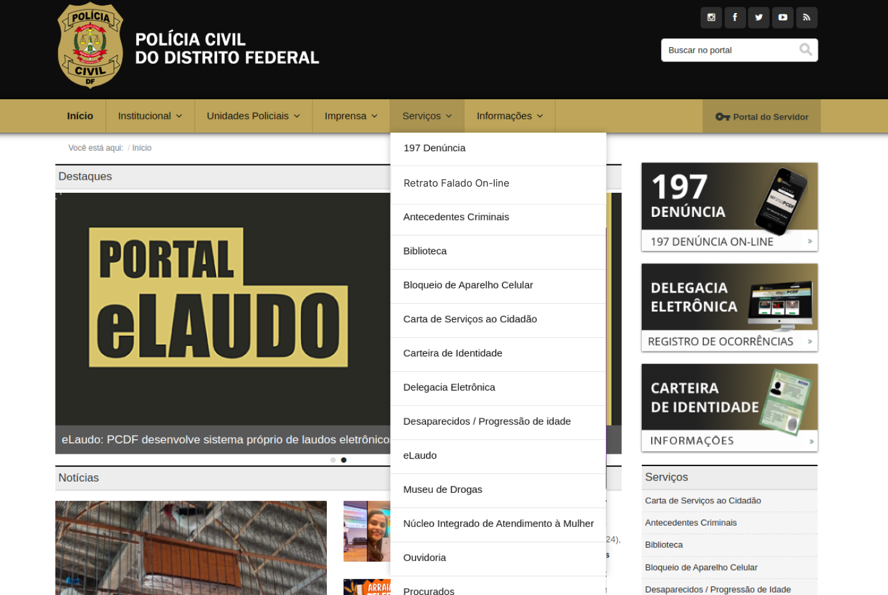

    
 Figura 11: confirmação do envio.
         
  
Fonte:  <a href="https://github.com/Renatinha28">Renata</a>

    
 

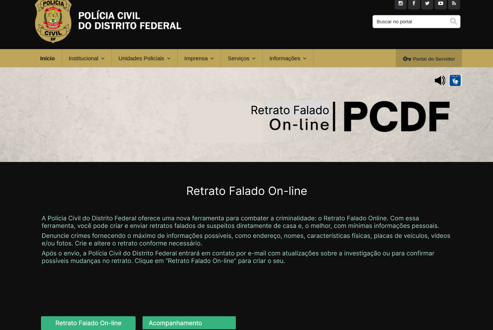

    
 Figura 11: confirmação do envio.
         
  
Fonte:  <a href="https://github.com/Renatinha28">Renata</a>

    
 

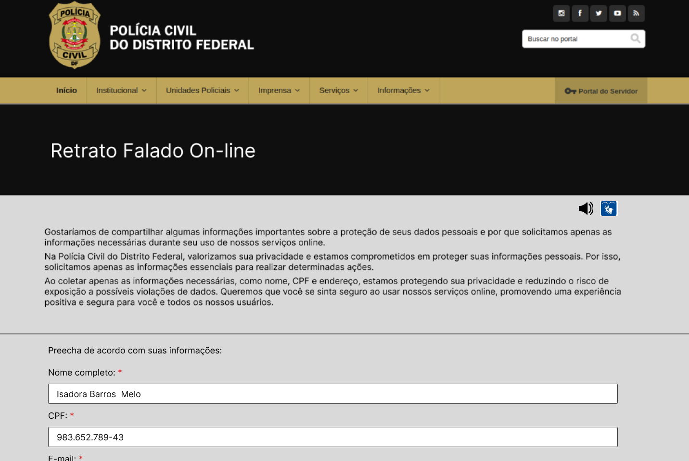

    
 Figura 11: confirmação do envio.
         
  
Fonte:  <a href="https://github.com/Renatinha28">Renata</a>

    
 

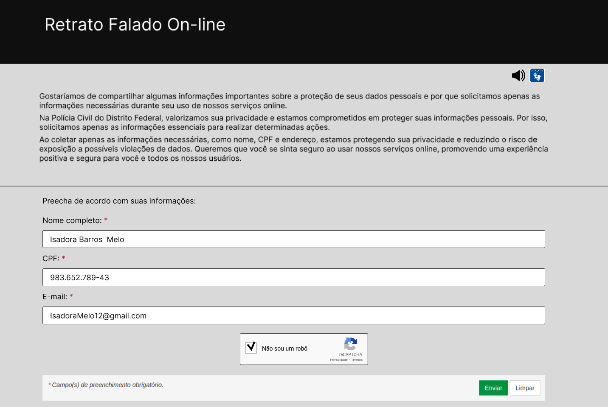

    
 Figura 11: confirmação do envio.
         
  
Fonte:  <a href="https://github.com/Renatinha28">Renata</a>

    
 

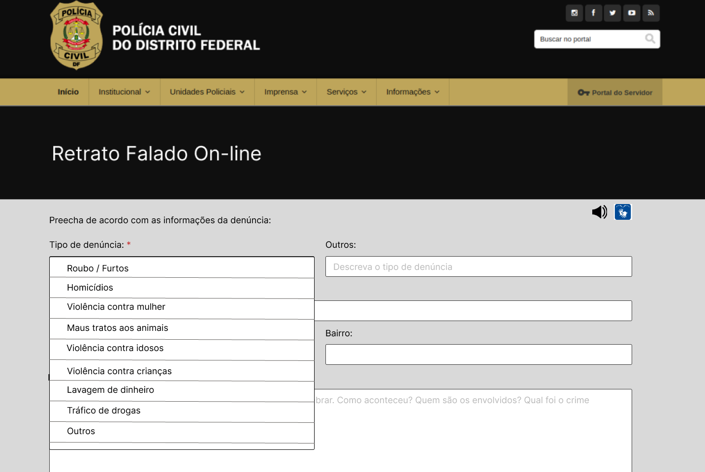

    
 Figura 11: confirmação do envio.
         
  
Fonte:  <a href="https://github.com/Renatinha28">Renata</a>

    
 

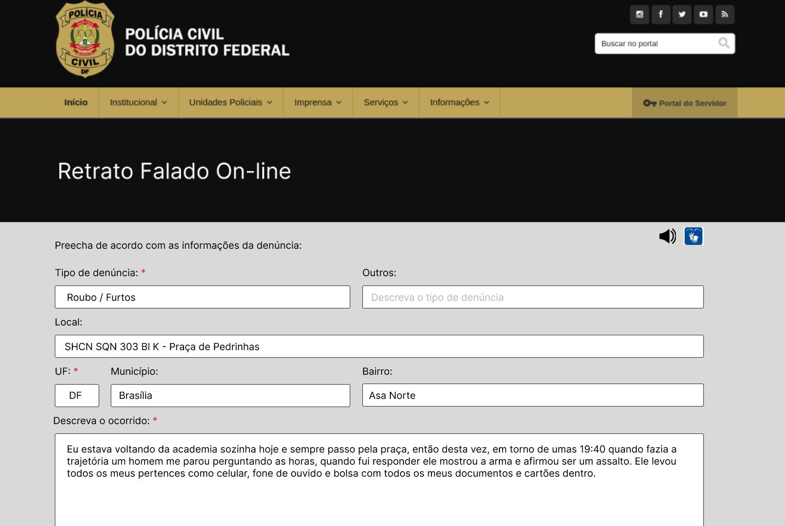

    
 Figura 11: confirmação do envio.
         
  
Fonte:  <a href="https://github.com/Renatinha28">Renata</a>

    
 

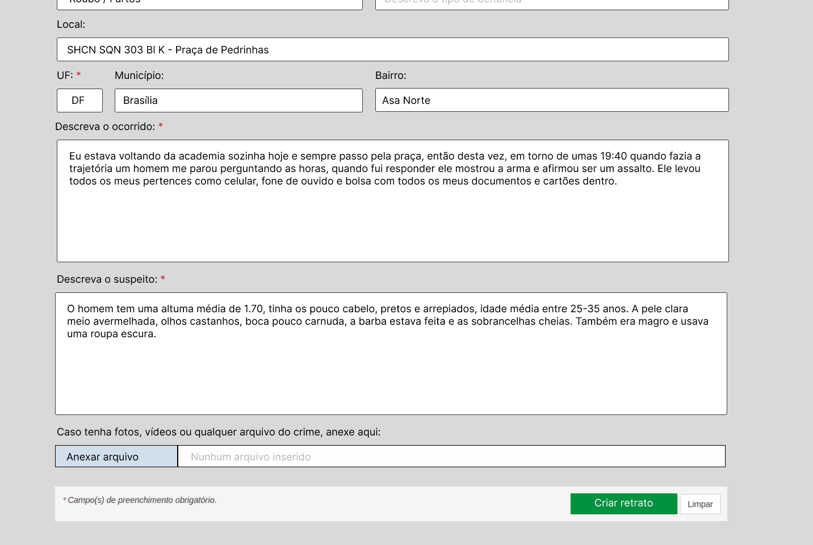

    
 Figura 11: confirmação do envio.
         
  
Fonte:  <a href="https://github.com/Renatinha28">Renata</a>

    
 

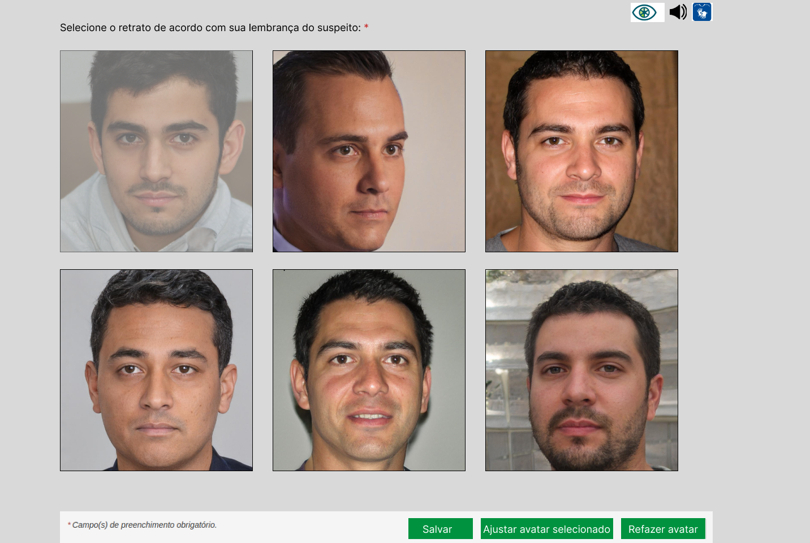

    
 Figura 11: confirmação do envio.
         
  
Fonte:  <a href="https://github.com/Renatinha28">Renata</a>

    
 

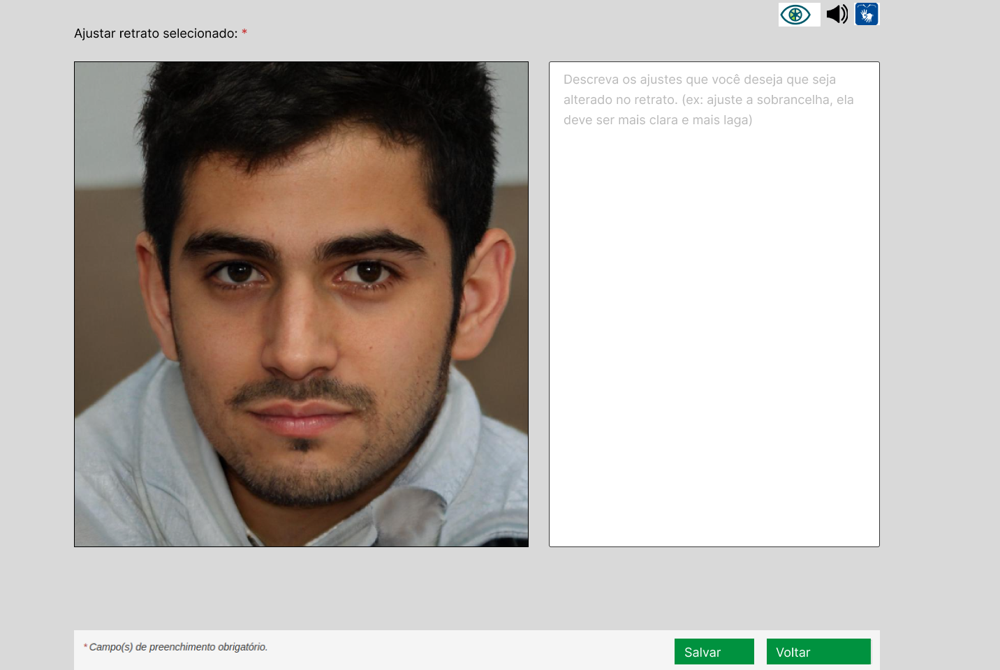

    
 Figura 11: confirmação do envio.
         
  
Fonte:  <a href="https://github.com/Renatinha28">Renata</a>

    
 

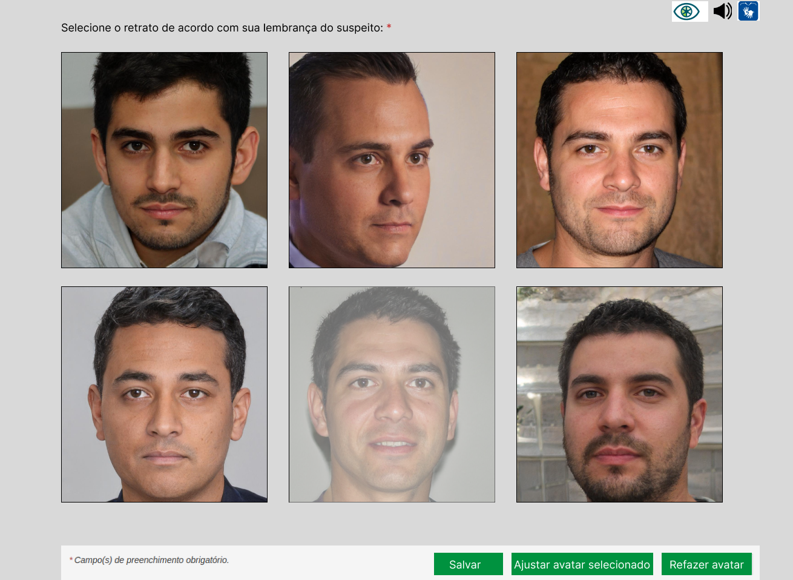

    
 Figura 11: confirmação do envio.
         
  
Fonte:  <a href="https://github.com/Renatinha28">Renata</a>

    
 

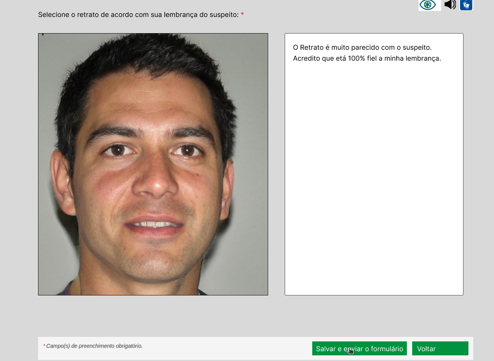

    
 Figura 11: confirmação do envio.
         
  
Fonte:  <a href="https://github.com/Renatinha28">Renata</a>

    
 

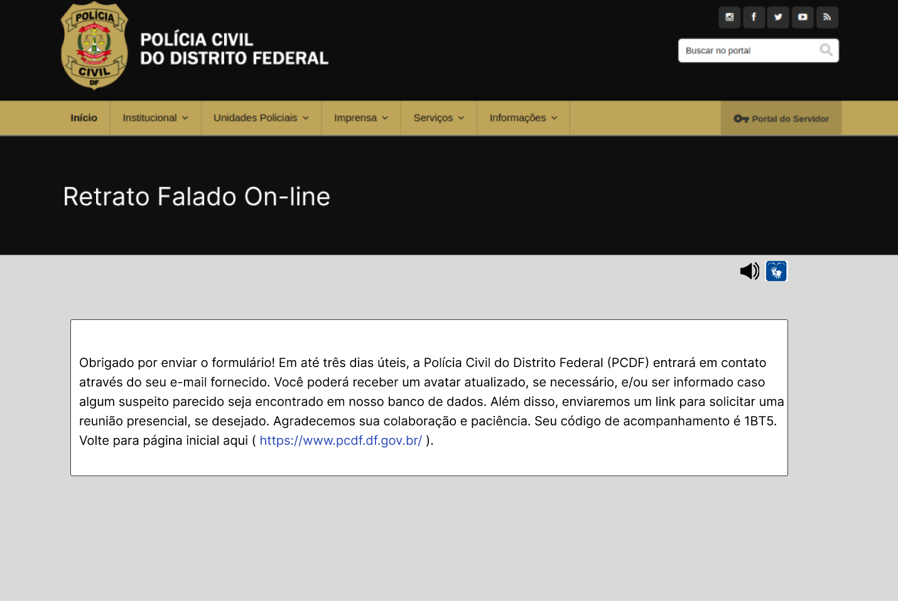

    
 Figura 11: confirmação do envio.
         
  
Fonte:  <a href="https://github.com/Renatinha28">Renata</a>

    
 

